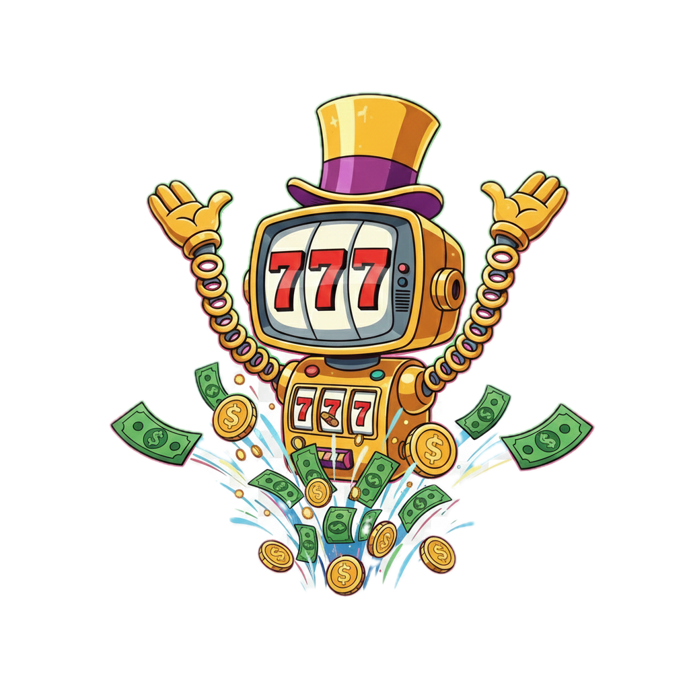

# Lottery

<figure><figcaption></figcaption></figure>

## How the Lottery Works

The jackpot is funded by **3% of all trading volume**. Once the jackpot wallet reaches **0.1 SOL**, a draw is triggered.

***

### Who Can Win?

To be eligible, you must hold at least **100,000 tokens** in your wallet.

***

### The Drawing Process

**Step 1: Sort holders into two groups**

* **Old holders** - people who held tokens before the previous draw
* **New holders** - people who started holding since the last draw

**Note:** If an old holder buys more tokens, they become a "new holder" for the next draw - giving them a chance at the larger new holder prize.

**Step 2: Pick one candidate from each group**

* The system randomly selects one person from the old holders
* The system randomly selects one person from the new holders

**Step 3: Coin flip**

* If both groups have a candidate, a 50/50 coin flip decides which one wins
* Only **one person** wins the jackpot

***

### Prize Amounts

| Winner Type | Share of Jackpot |
| ----------- | ---------------- |
| Old holder  | 20%              |
| New holder  | 50%              |

The remaining 30% rolls over to the next draw - this keeps the jackpot fund growing as long as there's trading volume.

**Example:** Jackpot has 1 SOL

* If an old holder wins → they get **0.2 SOL**
* If a new holder wins → they get **0.5 SOL**

***

### Draw Frequency

* The system checks every **30 minutes** if the jackpot balance is above 0.1 SOL
* If balance is too low, it backs off and checks less frequently (up to 8 hours between checks)
* Once triggered, the draw happens automatically

***

### The Randomness

Winner selection uses cryptographic randomness (the same secure randomness used in encryption), making it impossible to predict or manipulate who gets selected.

***

### Summary

| Setting                 | Value          |
| ----------------------- | -------------- |
| Minimum holding         | 100,000 tokens |
| Jackpot trigger         | 0.1 SOL        |
| Old holder prize        | 20%            |
| New holder prize        | 50%            |
| Rolls over to next draw | 30%            |

***

**In short:** Hold at least 100,000 tokens, and you're automatically entered. When the jackpot hits 0.1 SOL, one lucky holder wins - with new holders getting a bigger prize to reward early adoption.

<figure><figcaption></figcaption></figure>
