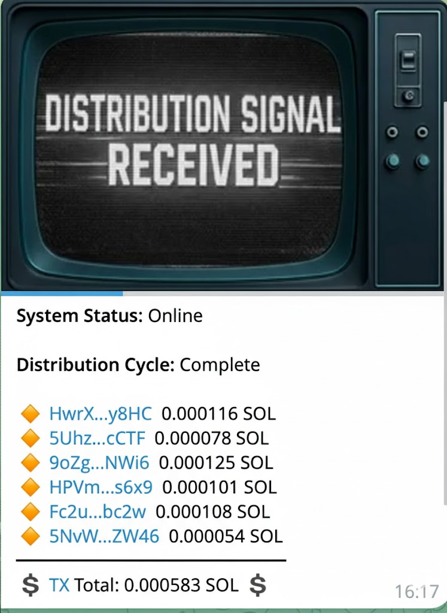

# Rewards

<figure><figcaption></figcaption></figure>

## How the Rewards Distribution Works

### Overview

The rewards system automatically collects transaction fees from token trades and redistributes them back to the community. This creates a passive income stream for holders who meet the minimum requirements.

***

### Who Is Eligible for Rewards?

To receive rewards, you must:

* **Hold at least 100,000 tokens** in your wallet
* **Have some SOL in your wallet** (to ensure your wallet is active on Solana)
* **Not be a system wallet** (liquidity pools, fee accounts, and other automated wallets are excluded)

***

### How Rewards Are Collected

Every time someone buys or sells the token, a small transaction fee is collected. These fees accumulate in a dedicated wallet [**nHboSbMF45fUSbqPs6175ysTXj9m6FaFbqryHi7FEES**](https://solscan.io/account/nHboSbMF45fUSbqPs6175ysTXj9m6FaFbqryHi7FEES?cluster=mainnet-beta)

Once the accumulated fees reach **10,000 tokens**, the distribution cycle begins automatically.

***

### The Distribution Process

#### Step 1: Fee Collection

The system first sweeps any uncollected fees from across the network into the main rewards wallet.

#### Step 2: Token-to-SOL Conversion

All accumulated tokens are swapped for SOL on a decentralized exchange. This converts the fees into a currency that can be easily distributed.

#### Step 3: The Three-Way Split

The converted SOL is divided into three portions:

| Destination          | Share | Purpose                                      |
| -------------------- | ----- | -------------------------------------------- |
| **Jackpot Fund**     | 30%   | Funds the lottery-style jackpot draws        |
| **Treasury/Buyback** | 20%   | Funds project development and token buybacks |
| **Holders**          | 50%   | Direct rewards to eligible token holders     |

#### Step 4: Calculating Your Share

Your individual reward is calculated based on **how much of the total supply you hold**.

**Simple formula:**

> Your Reward = (Your Tokens ÷ Total Supply) × Holders' Reward Pool

**Example:**

* Total reward pool for holders: 0.5 SOL
* Total token supply: 1,000,000,000 tokens
* You hold: 5,000,000 tokens (0.5% of supply)
* Your reward: 0.5% × 0.5 SOL = **0.0025 SOL**

The more tokens you hold, the larger your share of the rewards.

#### Step 5: Batch Distribution

Because Solana has transaction size limits, rewards are sent out in batches of 10 wallets at a time. This ensures all transactions complete successfully.

***

### Distribution Timeline

* **Cycle frequency:** Every 5 minutes, the system checks if there are enough accumulated tokens
* **Trigger threshold:** Distribution only occurs when at least 10,000 tokens have been collected
* **Delivery:** Once triggered, rewards are sent directly to your wallet — no claiming required

***

### What Gets Excluded?

The following are automatically filtered out and don't receive rewards:

* **System wallets** — Fee recipient, jackpot, buyback, and burn wallets
* **Liquidity pool vaults** — Automated market maker reserves
* **Program accounts** — Smart contract addresses
* **Wallets below minimum** — Holdings under 100,000 tokens
* **Empty wallets** — Wallets with zero SOL balance

***

### Notifications

After each distribution cycle, a notification is sent to the Telegram bot showing:

* Which wallets received rewards
* How much each wallet earned
* A link to verify the transaction on Solscan

<figure><figcaption>
Reward Rotifications Telegram Bot
</figcaption></figure>

***

### Summary

| Setting                               | Value                                |
| ------------------------------------- | ------------------------------------ |
| Minimum holding for rewards           | 100,000 tokens                       |
| Tokens needed to trigger distribution | 10,000 tokens                        |
| Holders' share                        | 50%                                  |
| Jackpot share                         | 30%                                  |
| Treasury share                        | 20%                                  |
| Distribution frequency                | Every 5 minutes (when threshold met) |

***

**In short:** Hold at least 100,000 tokens, keep some SOL in your wallet, and rewards will automatically flow to you based on your share of the total supply — no staking or claiming required.

<figure><figcaption></figcaption></figure>
