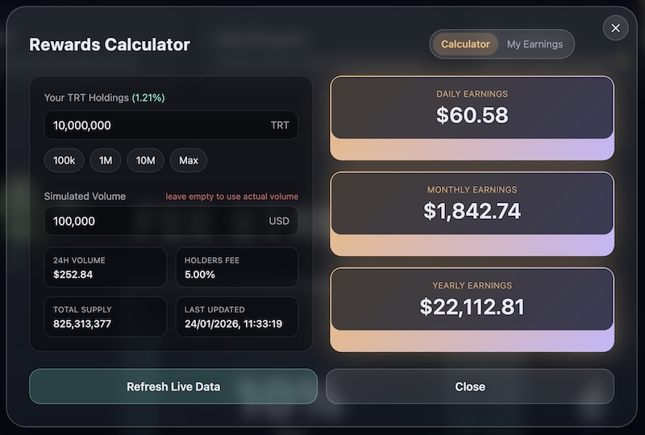
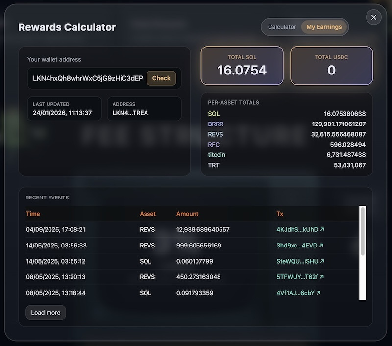

# Tools

## Rewards Calculator

The Rewards Calculator is a tool on the TRT website that helps you estimate your potential earnings and track your actual rewards. It has two modes: **Calculator** for projections and **My Earnings** for viewing your real earnings history.

***

### Calculator Mode

Use this mode to estimate how much you could earn based on your token holdings and current market conditions.

<figure><figcaption>Rewards Calculator</figcaption></figure>

#### How It Works

1. **Enter your holdings** - Type the number of TRT tokens you hold (or plan to hold)
2. **See your projections** - The calculator instantly shows your estimated daily, monthly, and yearly earnings

The calculator uses live data from the blockchain including:

| Metric | Description |
| ------ | ----------- |
| **24h Volume** | Current trading volume in USD |
| **Holders Fee** | Percentage of fees distributed to holders |
| **Total Supply** | Total circulating token supply |
| **Your Share** | Your percentage of the total supply |

#### Quick-Set Buttons

Don't want to type? Use the quick-set buttons to instantly set common holding amounts:

* **100k** - Set holdings to 100,000 tokens
* **1M** - Set holdings to 1,000,000 tokens
* **10M** - Set holdings to 10,000,000 tokens
* **Max** - Set holdings to the entire supply (to see theoretical maximum)

#### Simulated Volume

Want to see what your earnings would be at different trading volumes? Use the **Simulated Volume** field to enter a custom volume amount. Leave it empty to use actual live volume data.

This is useful for:

* Projecting earnings during high-activity periods
* Understanding how volume affects your returns
* Planning your investment based on different scenarios

***

### My Earnings Mode

Switch to the **My Earnings** tab to see your actual rewards history. This pulls real data from the blockchain.

<figure><figcaption>My Earnings</figcaption></figure>

#### Checking Your Earnings

1. **Enter your wallet address** - Paste your Solana wallet address
2. **Click Check** - The tool queries your earnings history
3. **View your totals** - See exactly how much you've earned

#### What You'll See

| Section | Description |
| ------- | ----------- |
| **Total SOL** | All SOL rewards you've received |
| **Total USDC** | All USDC rewards you've received |
| **Per-asset totals** | Breakdown of earnings by each token type |
| **Recent events** | Transaction history with timestamps and links |

#### Recent Events Table

The events table shows your reward history with:

* **Time** - When the reward was received
* **Asset** - Which token (SOL, USDC, etc.)
* **Amount** - How much you received
* **Tx** - Link to verify the transaction on Solscan

Click **Load more** to see older transactions.

> **Note:** Earnings data is indexed every 30 minutes. If you just received a reward, it may take up to 30 minutes to appear here.

***

### Live Data

The calculator automatically fetches live data when you open it. You can also click **Refresh Live Data** to get the latest metrics at any time.

If the connection fails, the calculator will show a notification and fall back to cached data so you can still use the tool.

***

### Summary

| Feature | Details |
| ------- | ------- |
| Location | TRT website |
| Calculator mode | Estimate earnings based on holdings |
| My Earnings mode | View actual reward history |
| Data source | Live blockchain data |
| Quick-set amounts | 100k, 1M, 10M, Max |
| Simulated volume | Test different volume scenarios |
| Earnings shown | Daily, Monthly, Yearly projections |
| Transaction history | Viewable with Solscan links |

***

**In short:** The Rewards Calculator helps you understand your potential and actual earnings. Use Calculator mode to project what you could earn, and My Earnings mode to see exactly what you have earned. All data comes directly from the blockchain.
